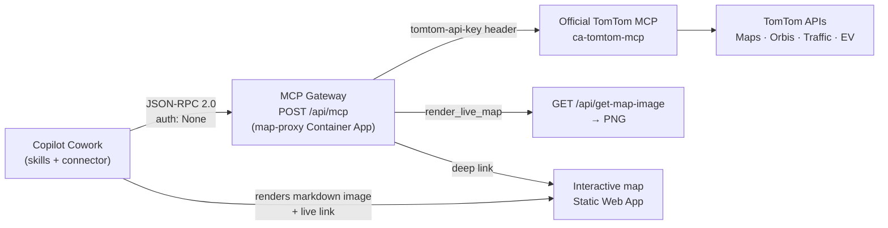

# TomTom Maps & Traffic — Microsoft Copilot Cowork plugin

A **Microsoft Copilot Cowork** custom plugin that brings TomTom location intelligence into Cowork:
geocoding & place search, driving/EV routing, real-time traffic, EV charging — and **dynamic, live
interactive map rendering inside the conversation**.

It is built on the **official TomTom MCP server** ([`tomtom-maps-mcp`](https://github.com/tomtom-international/tomtom-maps-mcp))
and a small **MCP gateway** (part of this repo's `map-proxy-api`) that keeps the TomTom API key
server-side and adds a `render_live_map` tool.

## Package contents

```
cowork-plugin/
├── manifest.json                 # M365 app manifest v1.28 (agentSkills + agentConnectors)
├── color.png / outline.png       # icons (192×192 / 32×32)
├── New-Icons.ps1                 # regenerates the icons
├── Build-CoworkPlugin.ps1        # validates + packages the .zip
├── COWORK-DEPLOYMENT-GUIDE.md    # register → package → upload (Add agent) → enable → test
└── skills/
    ├── tomtom-live-map/          # ⭐ renders inline image + live interactive map link
    ├── tomtom-location-search/   # geocode / reverse-geocode / POI & nearby search
    ├── tomtom-route-planning/    # routes, multi-stop, reachable range, search-along-route
    ├── tomtom-live-traffic/      # real-time incidents + live traffic overlay
    ├── tomtom-ev-journey/        # EV routing + charging-station search
    └── tomtom-traffic-analytics/ # historical MOVE analytics (optional connector)
```

## How it works



- **Skills correlate:** the search, routing, traffic and EV skills each finish by handing off to
  `tomtom-live-map`, so results are always shown on a map.
- **Live maps:** `render_live_map` returns a markdown **image** (rendered server-side) plus a link to
  the **live interactive map** (pan, zoom, live-traffic overlay).
- **Security:** the TomTom key lives only in the gateway (Azure). The gateway also filters out the
  upstream `tomtom-get-api-key` tool so the key can't leak into a conversation.

## Quick start

```powershell
# 1. (One-time) deploy the gateway to the map-proxy Container App
./deploy/Deploy-CoworkGateway.ps1 -TomTomApiKey "<YOUR_KEY>"

# 2. Package the plugin (optionally override the gateway URL)
./cowork-plugin/Build-CoworkPlugin.ps1

# 3. Upload cowork-plugin/dist/tomtom-cowork-plugin-1.0.0.zip
#    in the M365 Admin Center (see COWORK-DEPLOYMENT-GUIDE.md), then enable it
#    in Cowork → Sources & Skills.
```

## Try it in Cowork

- "Show **Cardiff Castle** on a live map."
- "Plan a **route from Cardiff to London** and show live traffic."
- "Find **EV chargers near Heathrow** and map them."
- "What's the **traffic like around Birmingham** right now?"

## Requirements

- Microsoft 365 **Copilot** licence and **Frontier preview** enrolment (Cowork is in preview).
- A deployed gateway (this repo's `map-proxy-api` with the `/api/mcp` route) and a TomTom API key.

See **[COWORK-DEPLOYMENT-GUIDE.md](COWORK-DEPLOYMENT-GUIDE.md)** for full instructions, and
[../docs/COWORK-PLUGIN-PLAN.md](../docs/COWORK-PLUGIN-PLAN.md) for the design rationale.
