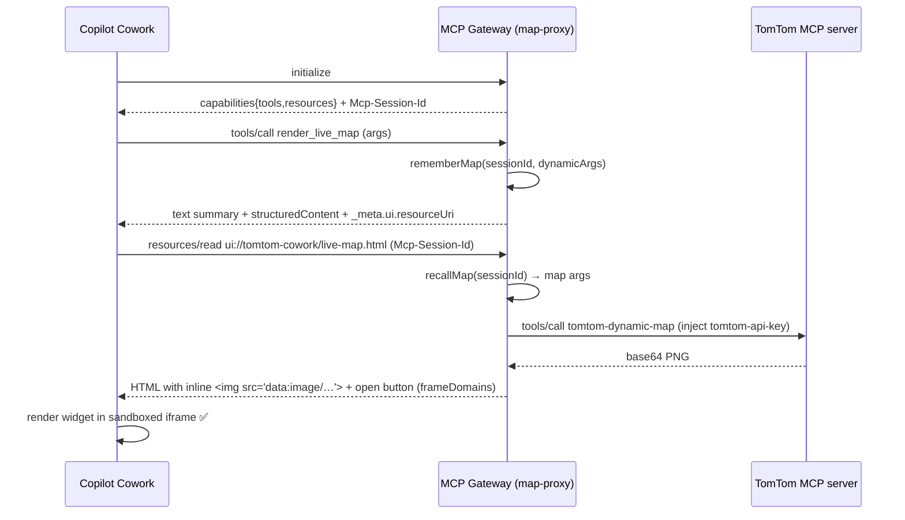

# Adapting the TomTom MCP Server for Microsoft Copilot Cowork

> How we made **live, dynamic TomTom maps render inside Microsoft 365 Copilot Cowork**, and the
> exact changes made to the MCP layer to get there. Written after debugging a real
> "*TomTom Maps & Traffic widget couldn't load*" failure in a live tenant (verified 2026‑06‑12).

---

## TL;DR

- Cowork renders rich tool output as **MCP Apps widgets** (the **MCP Apps extension, SEP‑1865**) —
  interactive HTML in a sandboxed iframe — **not** as inline markdown images.
- To show a widget, Cowork calls **`resources/read`** for a `ui://…` resource the tool declares,
  and renders the returned HTML. Its iframe **CSP only honours `frameDomains`** — arbitrary
  outbound requests (map tiles, SDKs, external ``) are **blocked**.
- Our Cowork connector points at an **MCP gateway** (the `map-proxy-api` Container App) rather than
  the TomTom MCP server directly. The gateway is where all the adaptation lives.
- The official TomTom MCP server *is* MCP‑Apps‑enabled, but its widgets fetch tiles/SDK from
  `api.tomtom.com`, which Cowork's sandbox blocks — so those widgets can't render in Cowork.
- **Fix:** the gateway now serves **its own self‑contained widget**, advertises/handles
  `resources/*`, and **bakes a server‑rendered map image** into the widget HTML (no client key, no
  blocked network calls), correlating the widget mount to the right map via the **`Mcp-Session-Id`**.

Result: a real TomTom map (markers / route / traffic) renders inline in Cowork, plus an
"Open live interactive map" button to the full pan/zoom Static Web App.

---

## ⚠️ Update (2026‑06‑12, later that day): the MCP Apps widget does not work in this Cowork build — use a markdown image + link instead

After extensive live testing in the tenant, the **MCP Apps widget path above turned out to be a
dead end in the current Cowork build**, and we replaced it with a simpler, reliable approach.
We verified **three** ways a tool can try to put a picture in front of the user and only one works:

| Mechanism | What happens in Cowork (verified) | Verdict |
|---|---|---|
| **MCP Apps widget** (`_meta.ui.resourceUri` → `resources/read` HTML) | Cowork's own widget host (`…widget-renderer.usercontent.microsoft/mcpwidget.html`) **aborts** (`net::ERR_ABORTED`) ~10 s after mount → **"widget didn't respond in time"** banner, *every* time. An immediate `ui/notifications/size-changed` at 0 ms did not help. And even if it mounted, the sandbox blocks the TomTom **tile network**. | ❌ Unusable |
| **MCP `image` content block** (`{ "type":"image", "data":…, "mimeType":… }`) | **Not painted to the user.** The model receives it as a vision input and *assumes* "a map is shown above," so it then omits the image **and** the link. Matches the docs: `content` is *model‑visible only*. | ❌ Worse than nothing |
| **Markdown image in the agent's reply** (``) | **Renders inline.** `imageUrl` points at the gateway's public `GET /api/get-map-image` endpoint (a normal `https` image, ~130 KB JPEG). | ✅ The only thing that works |

**Final design (gateway revision ≥ `0000018`):** `render_live_map` returns **plain text only** — no
widget binding (`_meta.ui` removed from both the tool definition *and* the result), no image content
block. The text instructs the agent to reply with the exact markdown:

```text


🗺️ **[Open the interactive live map](<interactiveUrl>)** — pan, zoom, and toggle live traffic.
```

`structuredContent` still carries `imageUrl` + `interactiveUrl`, and the `tomtom-live-map` skill's
**Output format** reinforces this. The **interactive link is always present in the text**, so even on
the occasional run where the model drops the inline image, the user can still open the fully
interactive map.

**Interactivity, honestly:** a genuinely pannable/zoomable map **inline** is *not possible* in
Cowork — its widget sandbox blocks the map‑tile network (this is also why the official TomTom widget
shows blank there). The inline result is a high‑quality **static snapshot**; the **interactive
experience is the "Open the interactive live map" link**, which opens the full MapLibre Static Web
App (drag, zoom, live‑traffic toggle).

> The sections below (§1–§7) document the original widget investigation. They remain accurate about
> *how the MCP Apps widget protocol works*, but the widget itself is **not used** in the shipping
> build — keep the markdown‑image approach above.

---

## ⚠️ Correction (2026‑06‑12, evening): Cowork **does** support interactive widgets — two claims above were wrong

A LinkedIn report that the **draw.io** MCP server renders interactive widgets in Cowork prompted a
deeper investigation, which surfaced an **official, Cowork‑specific** doc we'd missed:
[**MCP apps plugin author guide for Cowork (Frontier)**](https://learn.microsoft.com/microsoft-365/copilot/cowork/mcp-apps-support).
Two statements in the table/notes above are **incorrect** and are corrected here:

1. **"MCP Apps widget — Unusable."** ❌ Wrong. Widgets **do mount** in Cowork. With a corrected
   SEP‑1865 handshake, the widget iframe renders inline with a real loading state (verified: a live
   `<iframe>` + spinner appears, not the old "couldn't load" error).
2. **"The sandbox blocks the tile network, so inline interactivity is impossible."** ❌ Wrong. Cowork
   **honours `_meta.ui.csp.frameDomains`** (it maps to the iframe CSP `frame-src`). So the widget can
   **embed our interactive Static Web App (MapLibre) as a nested iframe** — that nested app is its own
   origin and loads its own tiles, giving **true inline pan / zoom / live‑traffic**. Our earlier tests
   failed only because we never *declared* `frameDomains`.

**What's still true / the real remaining blocker:** in the **current Cowork preview build in our
tenant**, the widget host page (`…widget-renderer.usercontent.microsoft/mcpwidget.html`) still
**aborts (`net::ERR_ABORTED`) ~10 s after mount** even after a spec‑correct, *bidirectional* handshake
(`ui/initialize` in **both** directions + `ping` + acknowledging every host→view request + reporting
size only after `initialized`). The abort is **independent of our handshake content**, which points to
a host‑side readiness contract that, in practice, needs the **official
[`@modelcontextprotocol/ext-apps`](https://github.com/modelcontextprotocol/ext-apps) SDK** wire
behaviour bundled into the widget (the draw.io / Microsoft‑sample pattern), or a Cowork host fix.

**What ships today (gateway revision `0000024`):**

- The interactive widget is **built and wired** (handshake + `frameDomains` SWA iframe + poster
  fallback) but **gated behind `ENABLE_COWORK_WIDGET` (default `false`)**, because with it on the user
  sees the host's "didn't respond in time" banner.
- With the flag **off** (default), `render_live_map` returns no `_meta.ui`, and the agent relays a
  **clickable inline image** — `[](interactiveUrl)` — plus the **"Open the
  interactive live map"** link. Tapping the map (or the link) opens the full MapLibre SWA. No banner,
  reliable every time.
- Flip `ENABLE_COWORK_WIDGET=true` (deploy: `-EnableCoworkWidget`) to re‑test the native widget once
  the SDK is bundled or the host is fixed.

> **Net:** the honest, verified position is now *"interactive widgets are supported by Cowork and our
> widget mounts; the preview host's readiness check isn't satisfied yet without the official SDK, so we
> ship the reliable clickable‑image + interactive‑link experience and keep the widget behind a flag."*
> The "Interactivity, honestly" paragraph above is superseded by this correction.

---

## 1. The symptom

In Cowork, the agent correctly called the TomTom tools (`tomtom-geocode`, `tomtom-ev-search`,
`render_live_map`), but every map surfaced as:

> **TomTom Maps & Traffic widget couldn't load.**  *(with a Retry button)*

The tools ran and returned data; only the **visual** failed.

## 2. Why it happened

Cowork is an MCP **host** that implements the **MCP Apps extension (SEP‑1865)**. When a tool's
result has an associated UI resource, Cowork mounts a widget and renders it in a sandboxed iframe.
Probing the upstream **TomTom Orbis Maps MCP Server v1.3.4** showed it already speaks MCP Apps:

```jsonc
// initialize → capabilities
{ "tools": { "listChanged": true }, "resources": { "listChanged": true } }

// resources/list → ui:// widget templates
{ "uri": "ui://tomtom-search/geocode/app.html", "mimeType": "text/html;profile=mcp-app" }
// …one per tool: routing, traffic, dynamic-map, data-viz, ev-search, …

// tools/call (show_ui) → result carries a widget marker
{ "type": "text", "text": "{ \"_meta\": { \"show_ui\": true, \"viz_id\": \"…\" } }" }
```

Two independent reasons the widget failed in Cowork:

1. **Our gateway didn't speak `resources/*`.** Cowork's render flow is:

   ```
   tools/call → (Cowork mounts widget) → resources/read(ui://…) → render HTML in iframe
   ```

   The gateway proxied only `tools/list` / `tools/call`; it neither advertised the `resources`
   capability nor answered `resources/read`, so Cowork's fetch failed → *"couldn't load."*

2. **Even proxied, the upstream widget can't load in Cowork.** Cowork's iframe CSP honours **only
   `frameDomains`** (nested‑iframe origins). It does **not** open arbitrary outbound network
   (`connectDomains` / `resourceDomains` are ignored). The TomTom `app.html` widgets fetch map
   tiles and the Maps SDK from `api.tomtom.com` at runtime → blocked by the sandbox → blank/failed.

> Sources: [Build plugins for Cowork](https://learn.microsoft.com/microsoft-365/copilot/cowork/cowork-plugin-development),
> [MCP apps plugin author guide for Cowork](https://learn.microsoft.com/microsoft-365/copilot/cowork/mcp-apps-support),
> [Add MCP apps to declarative agents](https://learn.microsoft.com/microsoft-365/copilot/extensibility/plugin-mcp-apps),
> [SEP‑1865](https://github.com/modelcontextprotocol/ext-apps/blob/main/specification/2026-01-26/apps.mdx).

## 3. The Cowork MCP Apps contract (what a server must do)

| Step | Requirement |
|------|-------------|
| Declare | The widget‑enabled tool carries **`_meta.ui.resourceUri`** = `ui://…` (≤ 1024 chars) in `tools/list`. OpenAI‑SDK alias: `_meta["openai/outputTemplate"]`. |
| Return data | The tool handler returns **data** (`content` text and/or `structuredContent`), **not HTML**. Inlined result delivered to the widget is capped at **64 KiB**. |
| Serve HTML | `resources/read` for that `ui://` returns `{ contents: [{ uri, mimeType: "text/html;profile=mcp-app", text: "<!doctype…>" }] }`. Cowork reads only `text`. |
| CSP | On the **UI resource's** `_meta.ui.csp`, only **`frameDomains`** is applied (→ `frame-src`). Route runtime data via a widget `tools/call`, `data:` URLs, or a framed origin. |
| Visibility | `_meta.ui.visibility`: `["model"]` agent‑callable, `["app"]` widget‑only (hidden from the agent). |
| Sessions | If the server returns **`Mcp-Session-Id`** at `initialize`, Cowork re‑attaches it on later calls **including the `resources/read` that mounts the widget**. |
| Degrade | Widgets are additive — always return useful text so the answer survives if the widget doesn't mount. |

## 4. What we changed (the gateway adaptations)

All changes are in the gateway that fronts the TomTom MCP server
([map-proxy-api/src/lib/mcpGateway.ts](../map-proxy-api/src/lib/mcpGateway.ts),
[map-proxy-api/src/functions/mcpGateway.ts](../map-proxy-api/src/functions/mcpGateway.ts)). The
upstream TomTom MCP server is **unmodified** — we adapt it at the gateway so the secret key stays
server‑side and the widget is Cowork‑compatible.

1. **Advertise `resources`** in `initialize` (`capabilities.resources`).
2. **Implement `resources/list`, `resources/read`, `resources/templates/list`.** `resources/list`
   advertises one widget, `ui://tomtom-cowork/live-map.html`.
3. **Serve our own self‑contained widget** (`text/html;profile=mcp-app`). It contains inlined CSS/JS
   only — no external assets — so it satisfies the Cowork sandbox.
4. **Bake the map server‑side (the crux).** Cowork mounts the widget using the **static**
   `resourceUri` from `tools/list` (it ignores a per‑call URI in the result `_meta`). So the widget
   HTML has no per‑call parameters in its URL. We solve data delivery **without** relying on an
   in‑iframe bridge:
   - `initialize` returns an **`Mcp-Session-Id`**;
   - on `tools/call` for `render_live_map` / `tomtom-dynamic-map` / `tomtom-data-viz`, the gateway
     **remembers the map args for that session** (in‑memory, TTL’d);
   - on `resources/read` (same session id, re‑attached by Cowork), the gateway **renders the map
     image upstream and inlines it as a `data:` URL** inside the widget HTML.

   No client key, no blocked network call — the image is pure `data:`. The Container App is pinned
   to **1 replica** so the session store is consistent.
5. **`render_live_map` tool** declares `_meta.ui.resourceUri` + `openai/outputTemplate`, returns a
   text summary (graceful degradation) + small `structuredContent` (`imageUrl`, `imageArgs`,
   `interactiveUrl`, `title`).
6. **App‑only `tomtom_map_image` tool** (`visibility: ["app"]`, hidden from the agent) lets the
   widget pull a rendered image via `tools/call` as a robust fallback bridge path.
7. **Belt‑and‑braces widget render order:** (a) inlined `data:` image → (b) framed image URL via
   `frameDomains` → (c) host bridge (`window.openai.toolOutput` / `callTool`). Plus an **"Open live
   interactive map"** button (`openExternal`) to the Static Web App for full pan/zoom + live traffic.
8. **Suppress the upstream widgets:** strip upstream `_meta` from `tools/list` and tool results so
   Cowork stops trying to mount the (non‑loadable) `ui://tomtom-*` widgets.
9. **Security:** the gateway still **filters `tomtom-get-api-key`** out of discovery and blocks
   calls to it, and keeps the TomTom key in a Container App secret (never in the manifest/skills/
   client). `frameDomains` is limited to the proxy + Static Web App origins.

## 5. How a live map renders (sequence)



## 6. Deploy & verify

```powershell
# Build + redeploy the gateway (ACR build → Container App), set keys, pin to 1 replica
./deploy/Deploy-CoworkGateway.ps1 -TomTomApiKey "<KEY>" -MapClientKey "<REFERRER_RESTRICTED_KEY>"

# Static + live gateway smoke
./tests/Invoke-CoworkPluginTests.ps1 -GatewayUrl "https://<map-proxy>/api/mcp"
```

**Evidence captured from the live ABS tenant (2026‑06‑12):**

- `initialize` → `capabilities: { tools, resources }`.
- `resources/read` returns `text/html;profile=mcp-app` HTML that inlines a `data:image/jpeg` map.
- Container App logs, one Cowork turn (same session id):
  ```
  mcpGateway: tools/call render_live_map session=b767e7d9-…-68f892e71a68
  mcpGateway: resources/read uri=ui://tomtom-cowork/live-map.html session=b767e7d9-…-68f892e71a68 baked=yes
  ```
- In Cowork: the **"couldn't load"** error is gone; the widget shows the rendered map image and the
  **"Open live interactive map ↗"** button; the agent reply links to the interactive map.

## 7. Notes, limits & hardening

### 7.1 Gotchas that actually blocked the widget (hard‑won)

Getting the widget to *paint* (not just mount) surfaced three non‑obvious blockers — worth knowing
if you build any Cowork MCP‑Apps widget:

1. **Mutable image tags don't redeploy.** `az containerapp update --image acr/app:fixedtag` with an
   **unchanged** image reference creates **no new revision and does not re‑pull** — your new build
   silently never runs. Always deploy a **unique tag** (e.g. append a timestamp) so a new revision
   rolls out. Verify with `az containerapp revision list` (newest `Active=True`, `Traffic=100`).
2. **You must complete the SEP‑1865 lifecycle or the skeleton never clears.** The widget has to send
   **`ui/initialize`**, then **`ui/notifications/initialized`**, then report height via
   **`ui/notifications/size-changed`** (drive it with a `ResizeObserver`) over
   `window.parent.postMessage`. Without the size signal, Cowork shows its loading skeleton until it
   times out (*"widget didn't respond in time"*).
3. **The only reliable way to show an image is a `data:` URL baked into the HTML body.** Cowork's
   sandbox blocks nested iframes to your origin and all external `fetch`/`img` (`connectDomains` /
   `resourceDomains` are ignored; only `img-src data:` works). And a **large** `data:` URL can be
   truncated — keep the image small (we use 640×400 compact JPEG). Put the ``
   **directly in the served HTML** so it paints with zero script/postMessage/network dependency; let
   the script only *enhance* (handshake, size, open‑map button).

### 7.2 Other notes


  Only the "Open interactive map" Static Web App link carries a maps key (`MAP_CLIENT_KEY`). Use a
  **referrer‑restricted** key scoped to the SWA domain; never the privileged server key.
- **Single replica** keeps the in‑memory session→map store consistent. For multi‑replica, back it
  with a shared store (e.g. Redis) or a signed, self‑contained token.
- **64 KiB** result cap to widgets — we keep `structuredContent` tiny and pull the image server‑side.
- **Markdown images don't render** inline in Cowork chat; rich visuals must go through the widget.
- Rotate any API key that has been shared outside a secret store.

## 8. Files

| File | Role |
|------|------|
| [map-proxy-api/src/lib/mcpGateway.ts](../map-proxy-api/src/lib/mcpGateway.ts) | Gateway logic: `resources/*`, widget HTML, session baking, `render_live_map`, `tomtom_map_image`, upstream‑widget suppression, key filtering |
| [map-proxy-api/src/functions/mcpGateway.ts](../map-proxy-api/src/functions/mcpGateway.ts) | Express route `POST/GET /api/mcp`; `Mcp-Session-Id` handling |
| [map-proxy-api/src/lib/mcpClient.ts](../map-proxy-api/src/lib/mcpClient.ts) | Upstream JSON‑RPC client (SSE/JSON), key injection |
| [deploy/Deploy-CoworkGateway.ps1](../deploy/Deploy-CoworkGateway.ps1) | Build + deploy the gateway, set secrets/env, pin replicas |
| [cowork-plugin/](../cowork-plugin/) | The Cowork plugin package (manifest, skills, icons, packager) |
| [tests/Invoke-CoworkPluginTests.ps1](../tests/Invoke-CoworkPluginTests.ps1) | Package validation + live gateway smoke tests |
