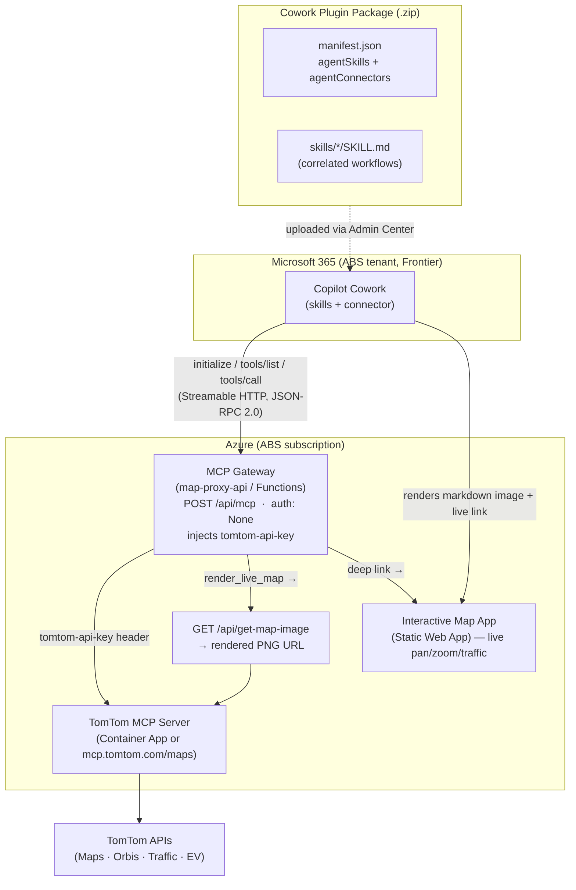

# TomTom MCP → Microsoft Copilot Cowork Custom Plugin — Master Plan

> **Status:** Living document. This is the backbone of the project. Every build/test step
> must be checked back against the **Alignment Checklist** at the end of this file.
>
> **Created:** 2026-06-12 · **Owner:** ABS · **Mode:** Proof of Concept (Frontier preview)

---

## 1. Objective

Extend the existing **TomTom MCP ↔ Copilot Studio POC** in this repository into a
**Microsoft Copilot Cowork (Frontier) custom plugin** that:

1. Integrates the **latest official TomTom MCP servers** (Maps + Traffic Analytics).
2. Bundles a **correlated set of Agent Skills** so Cowork knows *when* and *how* to use the
   TomTom tools.
3. Renders **dynamic and live maps inside Cowork** conversations.
4. Is deployable through **Microsoft 365 Admin Center → Copilot → Agents → All agents →
   Add agent** (Agent 365), and testable in the ABS Microsoft 365 tenant.
5. Captures the full **thought process, changes, and implementation** so the result can be
   published to the public repository.

---

## 2. Research Findings (evidence)

### 2.1 Official TomTom MCP repositories

| Repo | Package | Hosted endpoint | Auth | Notes |
|------|---------|-----------------|------|-------|
| [`tomtom-maps-mcp`](https://github.com/tomtom-international/tomtom-maps-mcp) | `@tomtom-org/tomtom-mcp` (v1.6.0) | **`https://mcp.tomtom.com/maps`** (Public Preview) | header `tomtom-api-key` | HTTP/Streamable transport, `/mcp` path in self-host. Backends: `tomtom-maps` (default) or `tomtom-orbis-maps` via `MAPS` env or `tomtom-maps-backend` header. Docker image `ghcr.io/tomtom-international/tomtom-maps-mcp:latest`. |
| [`tomtom-traffic-analytics-mcp`](https://github.com/tomtom-international/tomtom-traffic-analytics-mcp) | `@tomtom-org/tomtom-traffic-analytics-mcp` (v0.2.1) | none published (self-host only) | `TOMTOM_MOVE_PORTAL_KEY` + `TOMTOM_API_KEY` | MOVE Portal analytics; all tools require a `sql_queries` (DuckDB) param. stdio/Docker. |

**Maps tool catalogue** (default backend): `tomtom-geocode`, `tomtom-reverse-geocode`,
`tomtom-fuzzy-search`, `tomtom-poi-search`, `tomtom-nearby`, `tomtom-routing`,
`tomtom-waypoint-routing`, `tomtom-reachable-range`, `tomtom-traffic`, `tomtom-static-map`,
`tomtom-dynamic-map`.
**Orbis backend adds:** `tomtom-ev-routing`, `tomtom-search-along-route`, `tomtom-area-search`,
`tomtom-ev-search`, `tomtom-data-viz` (and drops `tomtom-static-map`).

**Traffic Analytics tools:** `tomtom-area-analytics-stats`, `tomtom-junction-search`,
`tomtom-junction-live-data`, `tomtom-junction-archive`, `tomtom-route-search`,
`tomtom-route-monitoring-details`, `tomtom-traffic-flow-segment`, `tomtom-traffic-incidents`.

The `tomtom-dynamic-map` tool stitches raster tiles server-side (skia-canvas), overlays
markers/routes/polygons/traffic, and returns a **Base64 PNG** — the basis for "dynamic maps".

### 2.2 Cowork plugin format (M365 App Package)

A Cowork plugin is a `.zip` (Microsoft 365 Unified App Manifest **v1.28**) containing:

```
plugin.zip
├── manifest.json     # agentSkills[] + agentConnectors[]
├── color.png         # 192×192 full-colour icon
├── outline.png       # 32×32 outline icon
└── skills/<name>/SKILL.md   (+ optional references/, scripts/)
```

Key rules (from the Build/Manage Cowork plugin docs):

- **Skills** use the open **Agent Skills** standard. `SKILL.md` frontmatter requires
  `name` (kebab-case, **must equal folder name** — ASKILL-P006/P007) and `description`
  (1–1024 chars, include trigger phrases). Body ≤ ~5,000 tokens; deep content goes in
  `references/`.
- **Connectors** (`agentConnectors[]`) reference a **remote MCP server**:
  `toolSource.remoteMcpServer.mcpServerUrl` (valid **HTTPS**), plus `authorization`.
  Required: unique `id`, `displayName`. Cowork performs dynamic discovery via
  `initialize` + `tools/list`, and executes with `tools/call` (**Streamable HTTP, JSON-RPC
  2.0, TLS 1.2+, < 30 s/call**).
- **Connector auth supported:** `None`, `OAuthPluginVault`, `ApiKeyPluginVault`
  (`referenceId` from Teams Developer Portal). `referenceId` **must be omitted** when
  `type` is `None`.
- **MCP annotations** (`readOnlyHint`, `destructiveHint`, `title`) drive confirmation
  prompts. Read-only tools auto-run (safe-by-default).
- Limits: ≤ 20 skills and ≤ 10 connectors per package.
- **Deploy/Test:** *M365 Admin Center → Manage Apps → Upload custom app* (sideload), then
  enable under **Cowork → Sources & Skills**. Org rollout via **Copilot → Agents → All
  agents → (Add agent / deploy)**. **Frontier preview enrolment is required** for Cowork.

### 2.3 Decisive auth constraint

The Microsoft auth doc states **MCP plugins do not support classic API‑key auth**, and even
`ApiKeyPluginVault` does not let us pin TomTom's **custom `tomtom-api-key` header name**
reliably. TomTom's hosted MCP *requires* that header.

➡️ **Decision:** Do **not** point Cowork directly at `mcp.tomtom.com`. Instead route Cowork
through our own **MCP gateway** (auth `None`) that injects `tomtom-api-key` server-side. This
removes the auth-header ambiguity, keeps the TomTom key off the client, lets us merge
Maps+Traffic behind one connector, add tool `annotations`, and add a **live-map** tool.

### 2.4 Confirmed live infrastructure (ABS tenant — verified 2026-06-12)

Resource group **`rg-tomtom-mcp`** (sub `ME-ABSx02771022-ghosking-1`, tenant `e4ccbd32…359f`):

| Component | Resource | Public URL |
|-----------|----------|------------|
| TomTom MCP server | Container App `ca-tomtom-mcp` (image `ghcr.io/tomtom-international/tomtom-mcp:latest`) | `https://ca-tomtom-mcp.ashydesert-9fc5fdf3.uksouth.azurecontainerapps.io` (`/mcp`) |
| **Map proxy → gateway host** | **Container App** `ca-tomtom-map-proxy` (Express `server.ts`, **not** a Function App) | `https://ca-tomtom-map-proxy.ashydesert-9fc5fdf3.uksouth.azurecontainerapps.io` |
| Interactive map | Static Web App `swa-tomtom-map` | `https://thankful-sky-03359db03.2.azurestaticapps.net` |

**The map proxy is a Container App running Express**, so the gateway is added as a new
Express route `POST /api/mcp` on that app (not as an Azure Function). The **Cowork connector
`mcpServerUrl`** = `https://ca-tomtom-map-proxy.ashydesert-9fc5fdf3.uksouth.azurecontainerapps.io/api/mcp`.

**Live `tools/list` (Orbis backend, 17 tools):** `tomtom-get-api-key`, `tomtom-get-viz-data`,
`tomtom-geocode`, `tomtom-reverse-geocode`, `tomtom-fuzzy-search`, `tomtom-poi-search`,
`tomtom-nearby`, `tomtom-poi-categories`, `tomtom-area-search`, `tomtom-ev-search`,
`tomtom-search-along-route`, `tomtom-routing`, `tomtom-reachable-range`, `tomtom-ev-routing`,
`tomtom-traffic`, `tomtom-dynamic-map`, `tomtom-data-viz`. **All carry `annotations`
(`readOnlyHint: true`).** No `tomtom-static-map` (Orbis drops it).

- **Security:** `tomtom-get-api-key` returns the raw key → **gateway filters it from
  `tools/list` and blocks calls** so it never leaks into a Cowork conversation.
- **`tomtom-dynamic-map` schema (confirmed):** `center{lat,lon}`/`bbox[w,s,e,n]`, `zoom 0-22`,
  `width`/`height 100-2048`, `markers[]` (lat/lon/label/color/category/priority/address/tags),
  `routes[]` (straight lines), **`routePlans[]`** (road-following: origin/destination/waypoints/
  travelMode/`traffic`/color), `polygons[]`, `showLabels`, `routeInfoDetail`,
  `detail` (`compact` keeps image <1 MB), `show_ui` (returns `viz_id`). → live-map maps a
  route to `routePlans[0]` with `traffic:true` and pins to `markers[]`.
- Interactive SWA query params: `center`, `zoom`, `markers`(b64 JSON), `route`(b64 JSON),
  `traffic`, `vizId`, `mcpUrl`, `apiKey`, `title`.

---

## 3. Target Architecture



**Live-map rendering inside Cowork.** Cowork renders agent messages as markdown. The gateway
exposes a synthetic **`render_live_map`** tool (and post-processes map tool results) returning:
- a **markdown image URL** → `…/api/get-map-image?...` (a real PNG, rendered inline), and
- a **live interactive deep link** → the Static Web App with encoded `center/markers/route/
  traffic` (pan, zoom, traffic overlay).

The TomTom key never leaves Azure (env/Key Vault). The image endpoint is anonymous GET.

---

## 4. Key Decisions

| # | Decision | Rationale |
|---|----------|-----------|
| D1 | **Gateway pattern** (Cowork → our `/api/mcp` with `None` auth → TomTom) | Custom `tomtom-api-key` header isn't expressible via Cowork MCP auth; keeps secret server-side; enables annotations + live-map tool. |
| D2 | Gateway responds with **`application/json`** JSON-RPC (no SSE on our side) | Streamable HTTP permits single JSON responses; simpler & Functions-friendly. Upstream SSE is parsed by existing `mcpClient.ts`. |
| D3 | Upstream default = **TomTom hosted** `mcp.tomtom.com/maps` (configurable to the Container App) | Zero extra hosting for Maps; Container App remains an option. |
| D4 | **Live maps** via markdown image URL + interactive SWA deep link | Reliable rendering in Cowork chat; reuses existing `get-map-image` + `interactive-map-app`. |
| D5 | Mark all TomTom read tools `readOnlyHint: true` | Auto-run (no confirmation) — smooth UX, safe-by-default. |
| D6 | Traffic-Analytics (MOVE) = **optional second connector** | Needs extra MOVE key + self-hosting; ship skill + clearly-optional connector. |
| D7 | Skills authored to the **open Agent Skills standard** (portable to Claude/VS Code) | Cross-platform reuse; matches Cowork requirement. |

---

## 5. Deliverables (file tree)

```
docs/
  COWORK-PLUGIN-PLAN.md            # this plan (backbone + alignment checklist)
  COWORK-IMPLEMENTATION-LOG.md     # running log of changes + evidence
cowork-plugin/
  manifest.json                    # M365 v1.28: agentSkills + agentConnectors (gateway)
  color.png  /  outline.png        # icons (192×192 / 32×32)
  README.md                        # plugin overview
  COWORK-DEPLOYMENT-GUIDE.md       # register → package → upload (Add agent) → enable → deploy
  Build-CoworkPlugin.ps1           # validate + Compress-Archive into dist zip
  skills/
    tomtom-location-search/SKILL.md
    tomtom-route-planning/SKILL.md
    tomtom-live-traffic/SKILL.md
    tomtom-ev-journey/SKILL.md
    tomtom-live-map/SKILL.md        # the live/dynamic map rendering centrepiece
    tomtom-traffic-analytics/SKILL.md
    */references/*.md               # companion docs (tool catalogue, coordinate formats)
map-proxy-api/
  src/lib/mcpGateway.ts             # gateway logic: initialize/tools.list/tools.call + render_live_map
  src/functions/mcpGateway.ts       # HTTP route POST /api/mcp (+ GET probe)
deploy/
  Deploy-CoworkGateway.ps1          # configure gateway app settings (or reuse Deploy-MapProxy)
tests/
  Invoke-CoworkPluginTests.ps1      # manifest+skills validation, zip build, live gateway smoke
```

---

## 6. Skills design (correlation)

All skills name connector tools explicitly and **delegate rendering to `tomtom-live-map`**.

| Skill | Trigger intent | Tools used | Output |
|-------|----------------|------------|--------|
| `tomtom-location-search` | "where is…", "find…near", POIs | geocode, reverse-geocode, fuzzy/poi/nearby, area-search | places table → handoff to live-map |
| `tomtom-route-planning` | "route/drive from A to B", multi-stop, coverage | routing, waypoint-routing, reachable-range, search-along-route | route summary → live-map w/ route |
| `tomtom-live-traffic` | "traffic near…", incidents, delays | traffic, traffic-flow-segment, traffic-incidents | incident table → live-map w/ traffic overlay |
| `tomtom-ev-journey` | EV trips, charging stops | ev-routing, ev-search | charging plan → live-map w/ charger markers |
| `tomtom-live-map` | "show on a map", "render/live map" | render_live_map (gateway), dynamic-map, data-viz | **markdown image + live interactive link** |
| `tomtom-traffic-analytics` | historical/MOVE analytics | junction/route/area analytics (sql_queries) | analytics tables (optional connector) |

**Correlation flow:** search/route/traffic/EV skills gather geospatial results, then each ends
by invoking `tomtom-live-map` to produce the visual. This is the "correlation of skills".

---

## 7. Deployment & test flow

1. **Provision gateway** on Azure (extend `map-proxy-api`; set `TOMTOM_API_KEY`,
   `MCP_SERVER_URL`, `INTERACTIVE_MAP_URL`). Confirm `POST /api/mcp` returns `tools/list`.
2. **Inject gateway URL** into `manifest.json` via `Build-CoworkPlugin.ps1 -GatewayUrl …`.
3. **Package** the `.zip` (manifest + icons + skills).
4. **Upload** in M365 Admin Center → *Manage Apps → Upload custom app* (sideload) — or
   **Copilot → Agents → All agents → Add agent** for org deployment (per screenshot).
5. **Enable** under Cowork → *Sources & Skills*; **deploy** to org or pilot group.
6. **Smoke test** prompts in Cowork (see §8) and capture evidence.

Prereqs: Frontier enrolment (admin too), M365 Copilot licence, Copilot/Global admin role,
custom-app sideloading allowed.

---

## 8. Testing & evidence plan

**Static (local, no secrets):**
- Manifest JSON valid; `agentSkills` folders exist; each has `SKILL.md`; `name` == folder &
  kebab-case (ASKILL-P006/P007); connector rules (HTTPS URL, `None` ⇒ no `referenceId`).
- `Build-CoworkPlugin.ps1` produces a valid `.zip` with root-level layout.

**Live gateway (needs TOMTOM_API_KEY + deployed/local gateway):**
- `initialize` → server info/capabilities.
- `tools/list` → TomTom tools + `render_live_map`, with `readOnlyHint`.
- `tools/call` `tomtom-geocode` (Cardiff Castle) → coords.
- `tools/call` `render_live_map` → image URL + live link (HTTP 200 PNG; link opens map).

**Tenant (browser, ABS tenant):**
- Upload package; enable in Cowork; run prompts: *"Show Cardiff Castle on a live map"*,
  *"Plan a route Cardiff→London and show traffic"*, *"Find EV chargers near Heathrow"*.
- Capture screenshots → `docs/COWORK-IMPLEMENTATION-LOG.md`.

---

## 9. Security considerations (OWASP-aware)

- TomTom key stored in Azure app settings/Key Vault; **never** in manifest/skills/client.
- Gateway is a **scoped** proxy: only forwards known TomTom MCP methods/tools; rejects others.
- `get-map-image` is anonymous — restrict `tool` to map tools; consider a signed/expiring
  token to prevent key-funded tile abuse (SSRF/cost). Documented as hardening item.
- TLS 1.2+ end-to-end; gateway validates JSON-RPC shape; sets sensible timeouts (< 30 s).
- Watch tool outputs for prompt-injection; skills instruct the agent to treat external text
  as data, not instructions.

---

## 10. Assumptions & open items

- **A1** Frontier preview is (or will be) enabled for the ABS tenant + admin account.
- **A2** A TomTom API key with Maps (and Orbis/EV where used) access is available.
- **A3** ✅ Satisfied — Azure infra already deployed in `rg-tomtom-mcp` (see §2.4); the gateway
  is added to the existing `ca-tomtom-map-proxy` Container App.
- **A4** Traffic-Analytics (MOVE) is optional; needs a MOVE Portal key + self-hosting.
- **O1** Whether Cowork renders MCP `image` content inline — we rely on markdown image URLs.
- **O2** Exact "Add agent" custom-upload path may vary during preview; sideload via Manage
  Apps is the documented fallback.

---

## 11. Alignment Checklist (revisit at every milestone)

- [x] Uses **latest official** TomTom MCP servers — Maps/Orbis integrated live; Traffic Analytics
  (MOVE) shipped as a documented **optional** connector + skill.
- [x] Cowork **custom plugin** package valid against v1.28 + ASKILL rules (validator passes).
- [x] **Correlated skills** present and cross-referencing `tomtom-live-map`.
- [x] **Dynamic + live maps** — gateway proven (image 200 PNG/JPEG + interactive link); **maps now
  render inside Cowork** via an MCP App widget (SEP‑1865) with server‑side image baking — verified
  in the ABS tenant (`baked=yes`). See `docs/COWORK-MCP-APPS-ADAPTATION.md`.
- [x] **Gateway** injects `tomtom-api-key`; Cowork connector uses `None`.
- [x] Deployable via **Admin Center → Agents → Add agent** (documented in the deployment guide).
- [~] **Smoke tests** + **evidence** — static ✅ and live gateway ✅ done; **tenant test pending**.
- [x] Workspace updated with **thought process + changes** (plan + implementation log); publish-ready.
- [x] Multiple **subagents** used (workspace inventory, MCP schema probe, build, HTTP smoke tests).
- [x] No secrets committed; key kept server-side (Container App secret); `tomtom-get-api-key` filtered.
- [ ] **Deploy gateway to Azure** + **upload/enable in ABS tenant** + **publish to public repo**
  (needs user approval / Frontier).
```